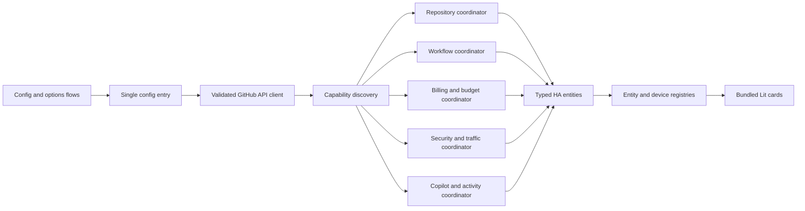

# Architecture

## Status and invariant

Version `0.2.0-beta.1` combines the account integration,
repository/workflow capabilities, Copilot/AI capabilities, and bundled
frontend architecture described here. Unsupported or unauthorized backend
categories are never simulated by the cards.

The non-negotiable packaging invariant is **one integration, one HACS
repository, one HACS installation**. Backend and all cards share:

- domain `github_insights`;
- one Home Assistant config entry in the initial release;
- one validated GitHub server and authenticated identity;
- one API client, capability model, coordinator graph, and token store;
- one version in the integration manifest and frontend package;
- one zip artifact and GitHub Release; and
- one upgrade and rollback lifecycle.

`frontend/` contains build-time source. Rollup writes the built,
source-map-free `github-insights-cards.js` directly into
`custom_components/github_insights/frontend/` before packaging. A design that
requires a second HACS plugin or separate card installation is invalid.

## Runtime boundaries

Home Assistant owns scheduling and state. The frontend is a pure view over
Home Assistant state, registries, and supported service/action calls; it never
polls GitHub directly and never receives the token.

## Backend modules

- `api.py`: async REST/GraphQL transport using Home Assistant's shared aiohttp
  session, fixed trusted host derivation, API-version headers, pagination,
  ETags, typed errors, and redacted logging.
- `models.py`: immutable normalized models carrying value, source, scope,
  freshness, confidence, availability reason, and `authoritative` or
  `estimated` provenance.
- `coordinator.py`: category coordinators under a config-entry runtime object.
  Intervals default to workflows 5 minutes, repositories 15 minutes,
  billing/security 60 minutes, and traffic 6 hours, constrained by safe option
  ranges.
- `entity.py`: coordinator entity base, stable unique IDs, device links,
  availability, translation keys, and shared metadata.
- platform modules: curated sensor/binary-sensor entities, then explicit
  buttons/switches/numbers/selects only when budget management is enabled.
- `diagnostics.py`: allow-list output plus recursive redaction.
- `repairs.py`: permission, unsupported endpoint, stale data, invalid host, and
  migration guidance requiring user action.

## Config entry and devices

The first release uses `single_config_entry: true`. The entry represents one
GitHub server and authenticated account. Organizations, enterprise reporting,
and repositories are selections beneath that identity.

This intentionally means one fine-grained PAT cannot aggregate multiple
resource owners when GitHub's token model forbids it. The config flow must
explain that limitation rather than silently combining credentials or creating
another entry.

Device hierarchy:

1. primary GitHub account device;
2. organization devices linked to the account;
3. repository devices linked to owner/account or organization;
4. Actions device;
5. billing and budgets device;
6. Copilot and AI usage device when available.

Unique IDs derive from immutable GitHub numeric/database IDs plus category keys,
never entity IDs, editable names, URLs, icon substrings, or frontend labels.

## Capability model

Setup probes GitHub server metadata and safe read endpoints, then records
capabilities by category:

- supported and authorized;
- supported but missing permission;
- unsupported by plan/server/API version;
- temporarily unavailable;
- not selected.

An unavailable category does not fail the complete entry. Entities are omitted
when the capability is structurally unsupported; temporarily failed entities
retain last-known-good values with stale/error metadata.

## Data model and provenance

Every metric records:

- canonical metric key and unit;
- GitHub scope and source endpoint/object;
- observation period and GitHub reporting timestamp;
- fetched time and expiration policy;
- authoritative/derived/estimated classification;
- capability and permission requirement;
- optional GitHub-provided URL.

Workflow wall-clock runtime is not treated as billed quantity. Monetary budget
and `prevent_further_usage` are authoritative when returned by GitHub. Equivalent
minutes are estimates based on an explicitly selected runner/SKU and a
documented price snapshot.

## Update and failure behavior

- Conditional REST requests preserve ETags and handle `304`.
- REST `Link` headers and GraphQL cursors are followed with hard page/item caps.
- Primary and secondary rate-limit signals are honored; `Retry-After` and reset
  times take precedence over exponential backoff with jitter.
- After account authentication succeeds, a rate-limited optional capability
  returns a partial snapshot with retry metadata instead of failing setup.
  Pending repository requests are cancelled and later capability fan-out stops.
- Coordinators use bounded concurrency and category-specific refreshes.
- Manual refresh is throttled.
- Authentication failures start reauthentication.
- A category failure does not discard successful categories.
- Cached values remain visible as stale and never become success-shaped zeros.

## Budget write boundary

Read-only mode is complete and default. Budget writes require:

1. explicit option enablement;
2. detected administrative/billing capability;
3. a write-capable token;
4. an action-specific confirmation showing server, owner, scope, product/SKU,
   amount, currency, and enforcement state;
5. stronger confirmation for removal or disabling enforcement; and
6. an immediate authoritative read-back after a successful mutation.

GitHub remains the enforcement system. The integration never simulates limits
by cancelling workflow runs and never automatically raises a budget.

Four Home Assistant services implement this boundary. Direct entity controls
only change local estimate or safety options; they never perform a financial
mutation. Service calls require exact confirmation text and use the
documented organization or enterprise CRUD route once, followed by an
authoritative read-back. Personal budget writes are not exposed.

## Frontend architecture

A centralized typed metric registry defines translation keys, value types,
icons, units, URLs/actions, filtering and sorting support, and editor options.
A selector pipeline applies capability filtering, include/exclude rules,
search, grouping, stable ordered multi-key sorting with explicit null handling,
and responsive layout.

Cards share a shell, status/empty/error/stale components, metric components,
repository row/detail components, visualizations, action handlers, and visual
editor primitives. Config is normalized immutably from concise and detailed
YAML forms; card-level defaults cascade to per-repository overrides.

Repository discovery uses integration/config-entry identifiers plus Home
Assistant device and entity registries and translation keys. It must refresh
when registries change and must not infer identity from entity IDs or device
names.

All controls use semantic buttons/links, keyboard focus, ARIA labels, touch
targets, localized relative time, reduced-motion support, and validated
backend-provided GitHub/GitHub Enterprise URLs.

The integration registers `/github_insights/frontend/` through Home
Assistant's supported static-path API. Lovelace resource mutation is not a
documented integration API, so users register the bundled module URL once.
This compatibility boundary is isolated and tested rather than reaching into
private Lovelace internals.

## Security boundaries

- Tokens and authorization headers never cross into entities or frontend data.
- The configured API base is normalized to GitHub.com or the explicitly
  configured GitHub Enterprise Server origin; response-provided cross-origin
  API URLs are rejected.
- Signed report URLs are consumed in memory and removed from diagnostics.
- GitHub-rendered strings are inserted as text, not unsafe HTML.
- Diagnostics use allow lists in addition to recursive redaction.
- No Home Assistant MCP endpoint or local-network information is product
  configuration.

## Distribution trade-off

HACS commonly distributes integrations and dashboard plugins as different
repository categories. This project deliberately does not take that conventional
split because the binding product requirement is one installation. The supported
design packages the frontend as runtime data inside the single integration and
serves it through Home Assistant's supported static-path API. If that mechanism
cannot be validated, release is blocked rather than falling back to a
separately installed plugin.
